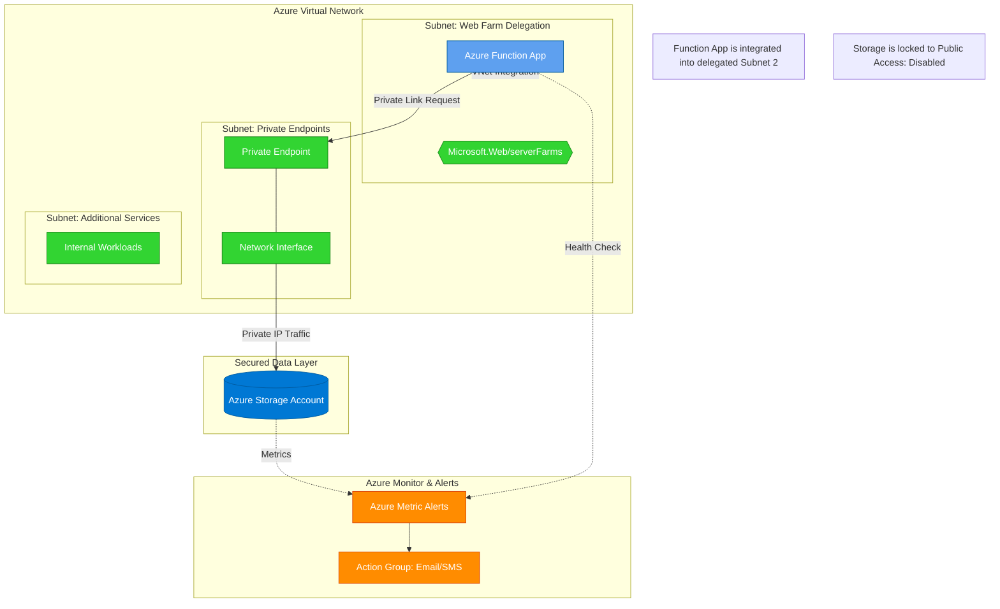

```mermaid
graph TB
    %% Definitions
    classDef storage fill:#0078d4,color:#fff,stroke:#005a9e;
    classDef compute fill:#5ea0ef,color:#fff,stroke:#005a9e;
    classDef network fill:#32d432,color:#fff,stroke:#107c10;
    classDef alert fill:#ff8c00,color:#fff,stroke:#d83b01;

    %% Outside VNet
    subgraph Monitoring_Alerts [Azure Monitor & Alerts]
        Alerts[Azure Metric Alerts]:::alert
        ActGrp[Action Group: Email/SMS]:::alert
    end

    subgraph Storage_Resource [Secured Data Layer]
        SA[(Azure Storage Account)]:::storage
    end

    %% Virtual Network
    subgraph VNet [Azure Virtual Network]
        
        subgraph Subnet_1 [Subnet: Private Endpoints]
            PE[Private Endpoint]:::network
            NIC[Network Interface]:::network
        end

        subgraph Subnet_2 [Subnet: Web Farm Delegation]
            Func[Azure Function App]:::compute
            Delegation{{"Microsoft.Web/serverFarms"}}:::network
        end

        subgraph Subnet_3 [Subnet: Additional Services]
            VMs[Internal Workloads]:::network
        end

    end

    %% Connections
    Func -->|VNet Integration| Subnet_2
    Func -->|Private Link Request| PE
    PE --- NIC
    NIC -->|Private IP Traffic| SA
    
    %% Monitoring Flow
    SA -.->|Metrics| Alerts
    Func -.->|Health Check| Alerts
    Alerts --> ActGrp

    %% Note for clarity
    Note1[Function App is integrated into delegated Subnet 2]
    Note2[Storage is locked to Public Access: Disabled]
```
