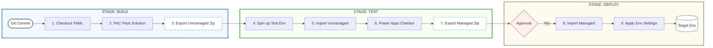

```mermaid
graph LR
    %% STAGE 1: BUILD
    subgraph BUILD [STAGE: BUILD]
        direction TB
        Commit([Git Commit]) --> Checkout[1. Checkout YAML]
        Checkout --> Pack[2. PAC Pack Solution]
        Pack --> Art1[3. Export Unmanaged Zip]
    end

    %% STAGE 2: TEST
    subgraph TEST [STAGE: TEST]
        direction TB
        Art1 --> TempEnv[4. Spin up Test Env]
        TempEnv --> ImportU[5. Import Unmanaged]
        ImportU --> Check[6. Power Apps Checker]
        Check --> Art2[7. Export Managed Zip]
    end

    %% STAGE 3: DEPLOY
    subgraph DEPLOY [STAGE: DEPLOY]
        direction TB
        Art2 --> Approve{Approval}
        Approve -- Yes --> Target[8. Import Managed]
        Target --> Settings[9. Apply Env Settings]
        Settings --> Live[(Target Env)]
    end

    %% Global Styling
    style BUILD fill:#f0f7ff,stroke:#005a9e,stroke-width:2px
    style TEST fill:#f6fff6,stroke:#107c10,stroke-width:2px
    style DEPLOY fill:#fffbf0,stroke:#847545,stroke-width:2px
    
    style Commit fill:#fff,stroke:#333
    style Art1 fill:#fff,stroke:#005a9e,stroke-dasharray: 5 5
    style Art2 fill:#fff,stroke:#107c10,stroke-dasharray: 5 5
    style Approve fill:#fff0f0,stroke:#a80000
    style Live fill:#fff,stroke:#333
```
