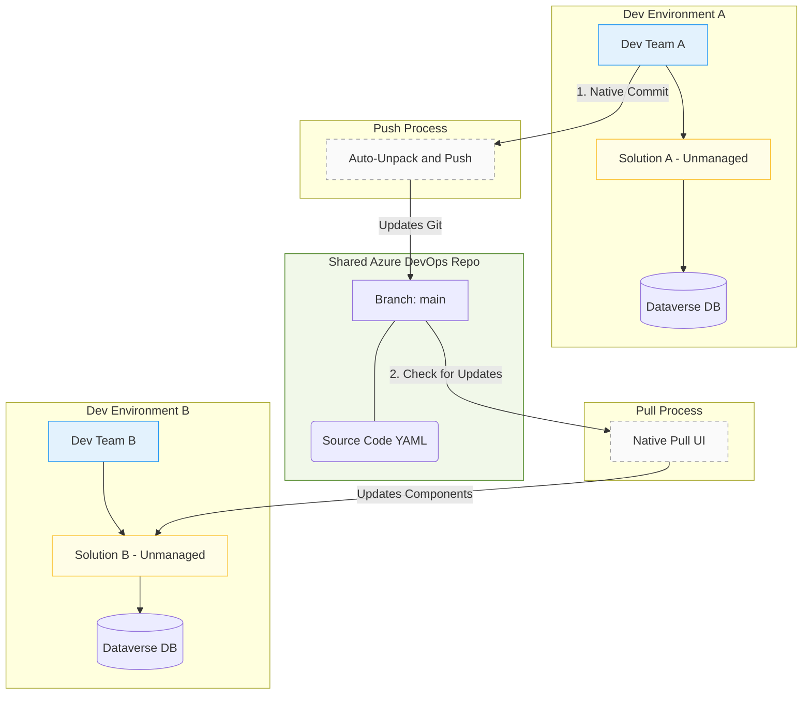

```mermaid
graph TD
    %% Define Teams and Environments
    subgraph EnvA [Dev Environment A]
        TeamA[Dev Team A]
        SolA[Solution A - Unmanaged]
        DataverseA[(Dataverse DB)]
        TeamA --> SolA
        SolA --> DataverseA
    end

    %% Define Shared Git Repository
    subgraph GitCloud [Shared Azure DevOps Repo]
        Branch_main[Branch: main]
        YamlFiles(Source Code YAML)
        Branch_main --- YamlFiles
    end

    %% Define Teams and Environment B
    subgraph EnvB [Dev Environment B]
        TeamB[Dev Team B]
        SolB[Solution B - Unmanaged]
        DataverseB[(Dataverse DB)]
        TeamB --> SolB
        SolB --> DataverseB
    end

    %% Workflow Actions
    TeamA -- "1. Native Commit" --> Action_Push
    
    subgraph SyncAction1 [Push Process]
        Action_Push[Auto-Unpack and Push] 
    end
    
    Action_Push -- "Updates Git" --> Branch_main

    Branch_main -- "2. Check for Updates" --> Action_Pull
    
    subgraph SyncAction2 [Pull Process]
        Action_Pull[Native Pull UI]
    end
    
    Action_Pull -- "Updates Components" --> SolB

    %% Styling
    style TeamA fill:#E3F2FD,stroke:#2196F3
    style TeamB fill:#E3F2FD,stroke:#2196F3
    style GitCloud fill:#F1F8E9,stroke:#558B2F
    style SolA fill:#FFFDE7,stroke:#FBC02D
    style SolB fill:#FFFDE7,stroke:#FBC02D
    style Action_Push fill:#FAFAFA,stroke:#9E9E9E,stroke-dasharray: 5 5
    style Action_Pull fill:#FAFAFA,stroke:#9E9E9E,stroke-dasharray: 5 5
```
