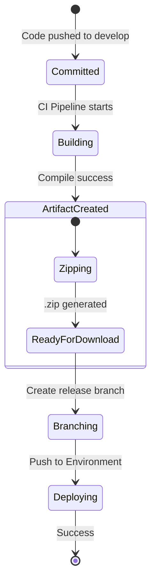

```mermaid
stateDiagram-v2
    [*] --> Committed: Code pushed to develop
    Committed --> Building: CI Pipeline starts
    Building --> ArtifactCreated: Compile success
    
    state ArtifactCreated {
        [*] --> Zipping
        Zipping --> ReadyForDownload: .zip generated
    }
    
    ReadyForDownload --> Branching: Create release branch
    Branching --> Deploying: Push to Environment
    Deploying --> [*]: Success
```
