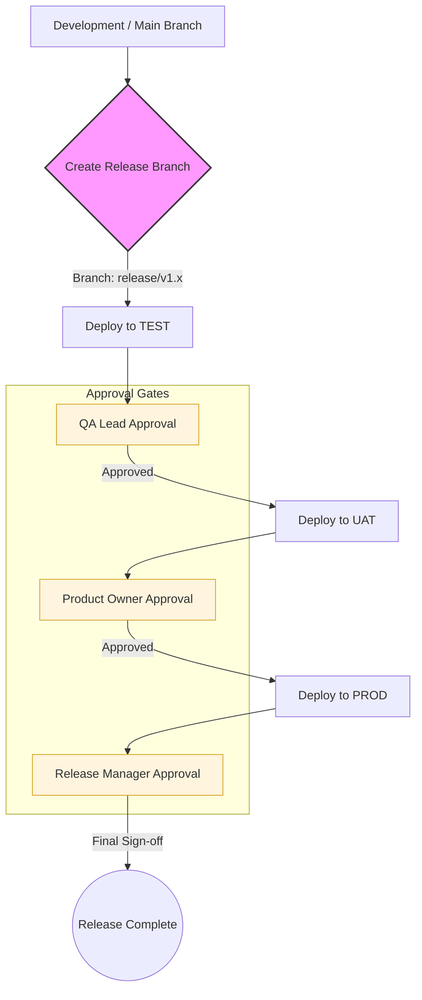

```mermaid
graph TD
    A[Development / Main Branch] --> B{Create Release Branch}
    B -->|Branch: release/v1.x| C[Deploy to TEST]
    
    subgraph Approval Gates
        D[QA Lead Approval]
        F[Product Owner Approval]
        H[Release Manager Approval]
    end

    C --> D
    D -->|Approved| E[Deploy to UAT]
    E --> F
    F -->|Approved| G[Deploy to PROD]
    G --> H
    H -->|Final Sign-off| I((Release Complete))

    style B fill:#f9f,stroke:#333,stroke-width:2px
    style D fill:#fff4dd,stroke:#d4a017
    style F fill:#fff4dd,stroke:#d4a017
    style H fill:#fff4dd,stroke:#d4a017
```
