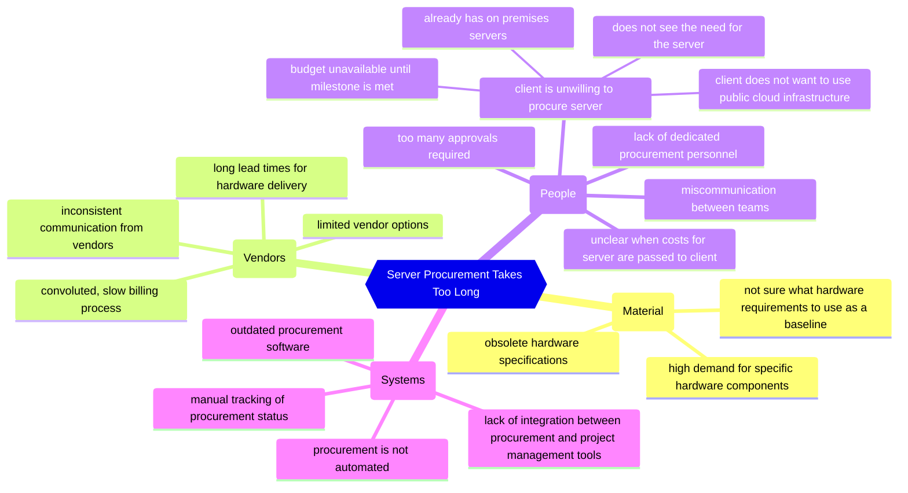

### Server Procurement Takes Too Long: Causes and Effects

```mermaid
mindmap
root{{Server Procurement Takes Too Long}}
  (Material)
    not sure what hardware requirements to use as a baseline
    obsolete hardware specifications
    high demand for specific hardware components
  (Vendors)
    convoluted, slow billing process
    limited vendor options
    long lead times for hardware delivery
    inconsistent communication from vendors
  (People)
    too many approvals required
    unclear when costs for server are passed to client
    client is unwilling to procure server
      budget unavailable until milestone is met
      does not see the need for the server
      already has on premises servers
      client does not want to use public cloud infrastructure
    lack of dedicated procurement personnel
    miscommunication between teams
  (Systems)
    procurement is not automated
    outdated procurement software
    lack of integration between procurement and project management tools
    manual tracking of procurement status
```
