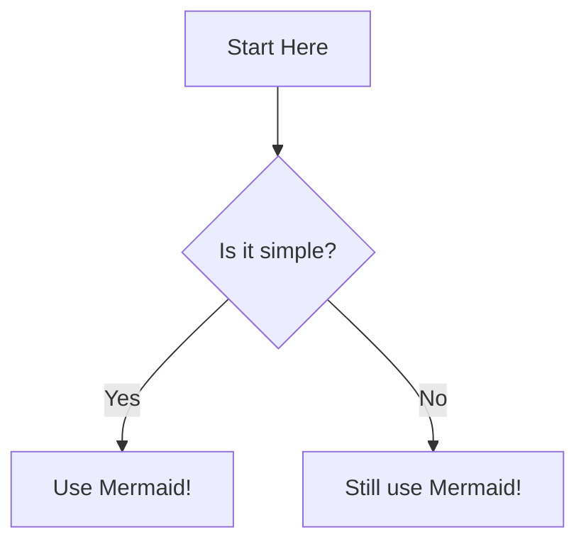

# 🧜‍♀️ Mermaid Gaphs and Diagrams Made Easy

## 🌊 Dive In!

Welcome to **MermaidGraphs**, your go-to repository for mastering the art of creating beautiful and functional diagrams using the [Mermaid](https://mermaid.js.org/) syntax!

Mermaid lets you generate diagrams and flowcharts from **simple text and markdown**. It's perfect for documentation, technical designs, and just making things look cool. This repo is a collection of useful, creative, and sometimes hilarious Mermaid code examples and templates.

---

## ✨ Why This Repo?

* **Quick Start:** Copy-paste-and-go examples for common diagrams (Flowcharts, Sequence, Gantt, Class, etc.).
* **Best Practices:** Learn how to style, link, and structure complex diagrams for maximum clarity.
* **Inspiration:** See how Mermaid can be used for non-traditional diagrams (like the one below! 😉).
* **Contribution Friendly:** Got a neat diagram? Share it with the shoal!

---

## 🛠️ Getting Started

You don't need much to get started—just a place that supports **Mermaid rendering** (like GitHub, GitLab, many documentation tools, or the [Mermaid Live Editor](https://mermaid.live/)).

### Basic Syntax Example

Here’s the simplest way to start a flowchart:

---

## 🤝 Contribute

We are building a vibrant coral reef of Mermaid diagrams! Contributions are welcome. Please check out our **[CONTRIBUTING.md](CONTRIBUTING.md)** for guidelines on submitting your own cool Mermaid code.

1.  Fork the repository.
2.  Create a new branch (`git checkout -b feature/CoolDiagram`).
3.  Add your awesome new Mermaid file in the appropriate directory.
4.  Commit your changes (`git commit -m 'feat: Added a diagram about cat behavior'`).
5.  Push to the branch (`git push origin feature/CoolDiagram`).
6.  Open a Pull Request!

Happy graphing! 🚀
